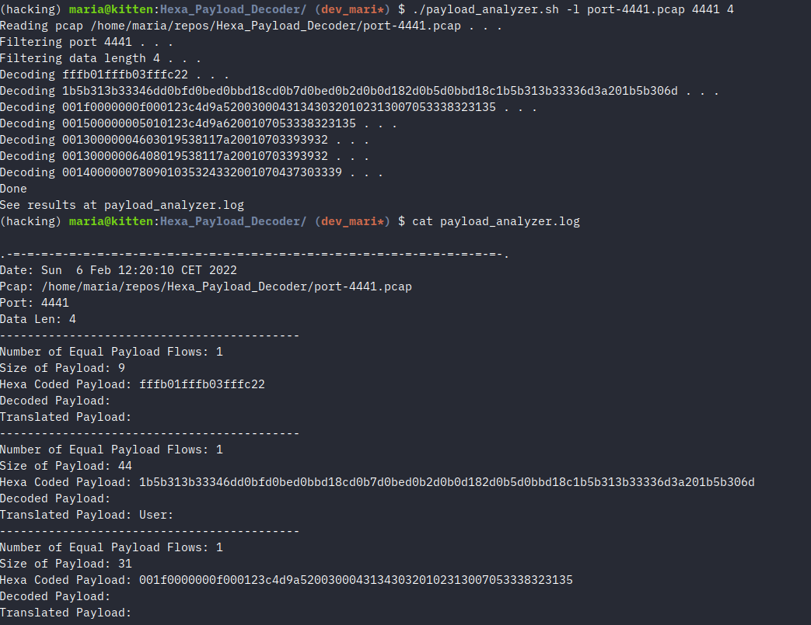

<p align="left">
     
</p>


# Hexa Payload Decoder 

[](https://github.com/stratosphereips/Hexa_Payload_Decoder/actions/workflows/docker-image.yml)


### Problem Statement
When analyzing malware traffic on the network sometimes we find ourselves spending several minutes decoding the data from the hexadecimal streams. In the best case scenario we can use some tools (like Wireshark) to see this hexadecimal streams already decoded, but sometimes the decoded characters are not supported by most of the networking analyzers.

### The Solution
The idea is to develop a tool aimed to extract the TCP hexadecimal data from netwrok captures filtering by a specific port provided by the user, decode it from hexadecimal and translate it from any language to english.

The workflow of the tool is the following:
  - User runs the bash script with two parameters, the pcap file to analyze and some port.
  - The bash script extracts the hexadecimal data from the TCP flows filtering by the user provided port using Tshark command.
  - The extracted hexadecimal data are decoded as UTF-8 using the python standard library.
  - The decoded data is finally passed to Libre Translate python library which automatically detects the language and translates it to english.
  - The decoded and translated data is written to an output file to see the results.
  - This flow repeats for every TCP flow found in the pcap.
  
#### Help:
- Hexadecimal decoder and translator for network analysis. 
```
usage:  python3 hexa_payload_decoder.py [-h] [-d DECODE | -c] [-r READ] [-p PORT] [-l LENGTH]

optional arguments:
  -h, --help            show this help message and exit
  -d DECODE, --decode DECODE
                        Decode and translate the given string.
  -c, --clean           Clean the contents of the log file.

Analysis:
  -r READ, --read READ  Name of the pcap file that is analyzed.
  -p PORT, --port PORT  Analyze traffic for a specific port only.
  -l LENGTH, --length LENGTH
                        Analyze data streams longer than the given length.
```


---

Here is the script working with some example pcap:



---

### Requirements:

- Libre Translate Python Library https://github.com/argosopentech/LibreTranslate-py
- Tshark https://www.wireshark.org/docs/man-pages/tshark.html

